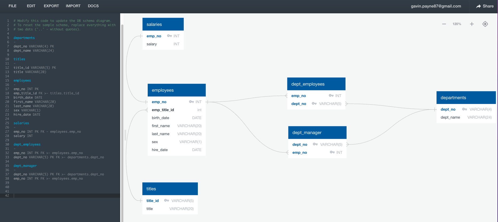

# Data modelling and analysis using postgreSQL in pgAdmin
## Overview
This project takes a hypothetical database of employees made up of six .csv files, and:
- creates a schema to model the relationship between the tables using an entity relationship diagram (ERD);
- performs CRUD operations on the database once loaded into PostgreSQL.

It is a completed module assignment for data analyics and visualisation bootcamp I am doing.

## Queries
The > queries subdirectory contains this screenshot of the database schema:

The schema was created using [quickdatabasediagrams.com](www.quickdatabasediagrams.com)

Queries use PostgreSQL RDMS and the pgAdmin management tool.

- The challenge_schema .sql creates the tables in postgres, the table data was imported using pgAdmin.
- The challenge_queries .sql contains queries to perform an analysis of the database. These include joins, aggregates, and sub-queries.

The activity consolidated the concept of primary keys, foreign keys and composite keys, as well as the use of through-tables.

## How to run
Clone this repo in git using the this command:
'''
git clone https://github.com/GPN87/modelling_and_analysis_SQL.git 
'''

Repository contains a .gitignore file that ignores .DS_Store files.

